# Pixel Art Studio


Pixel art skill for AI agents. Convert photos, generate images and videos from [Pollinations](https://pollinations.ai) — 40+ retro palettes from real hardware, zero API keys.

## Install

Point your AI agent to this repo: **https://github.com/Synero/pixel-art-studio**

Works with **Hermes**, **OpenClaw**, **Claude Code**, **Cursor**, or any agent that supports skills/instructions. Your agent reads SKILL.md, installs dependencies, and handles everything.

Manual install:
```bash
git clone https://github.com/Synero/pixel-art-studio.git
pip install -r requirements.txt
```

## What It Does

| Script | Input | Output |
|--------|-------|--------|
| `pixelart.py` | User photo | Pixel art PNG (14 presets, 40+ palettes) |
| `pixelart_image.py` | Text prompt | Pixel art PNG (Pollinations) |
| `pixelart_video.py` | Text prompt | Animated MP4 + optional GIF |

## Examples

### Image Generation (`pixelart_image.py` — text → pixel art)

| | |
|---|---|
| 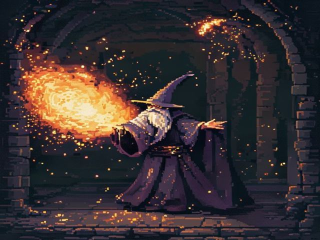 | 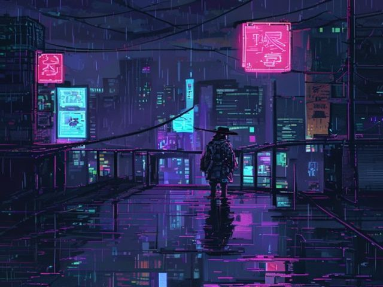 |
| *NES 8-bit — wizard* | *SNES + cyberpunk — samurai in the rain* |
| 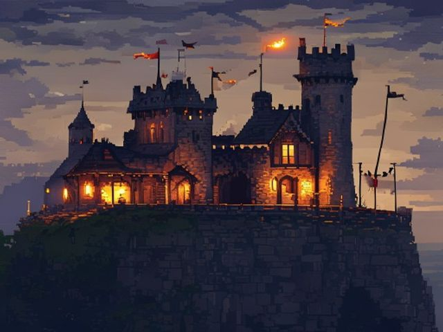 | 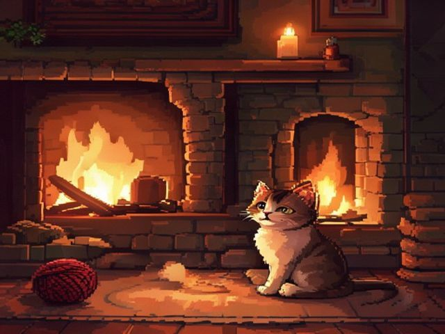 |
| *NES + medieval — castle at dusk* | *Indie + cozy — cat by fireplace* |

### Photo Conversion (`pixelart.py` — photo → pixel art)

| Input | Game Boy | NES | SNES |
|----------|----------|-----|------|
| 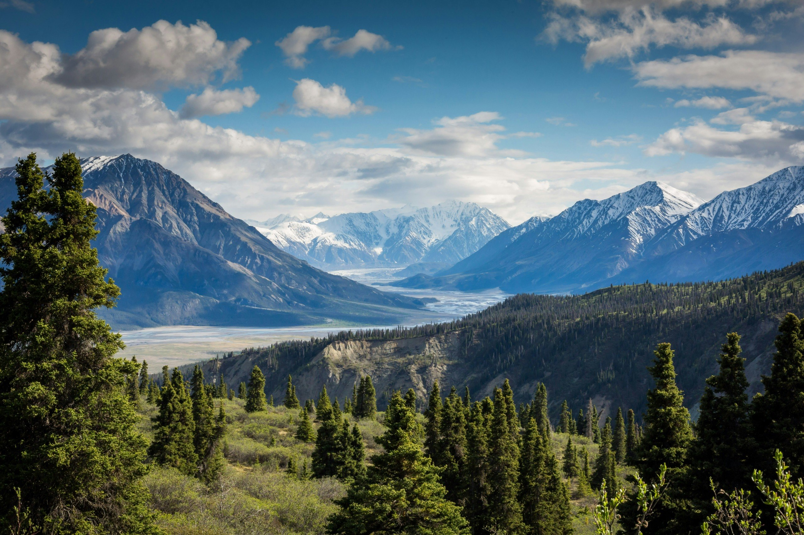 | 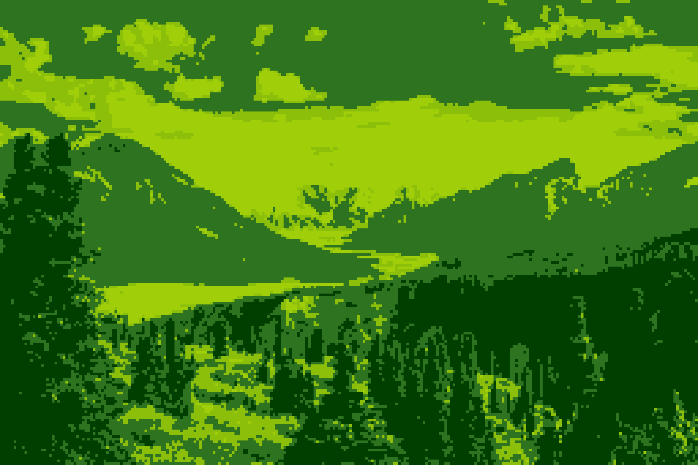 | 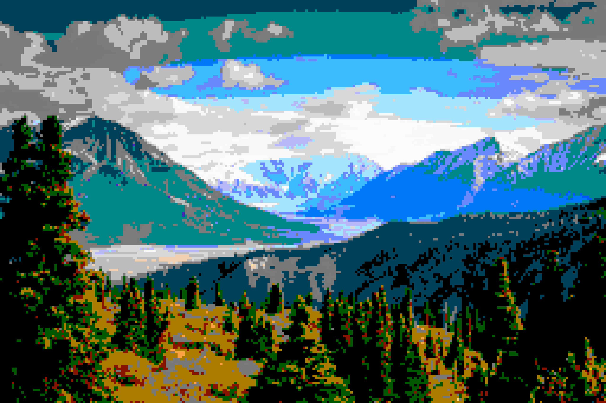 | 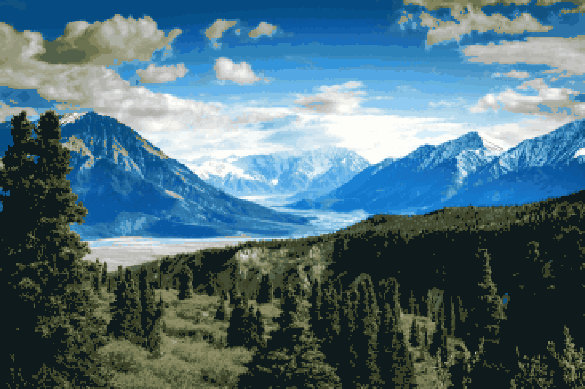 |
| *Landscape* | *4-color green palette* | *NES limited palette* | *64-color quantized* |

| Input | Game Boy | NES | SNES |
|----------|----------|-----|------|
| 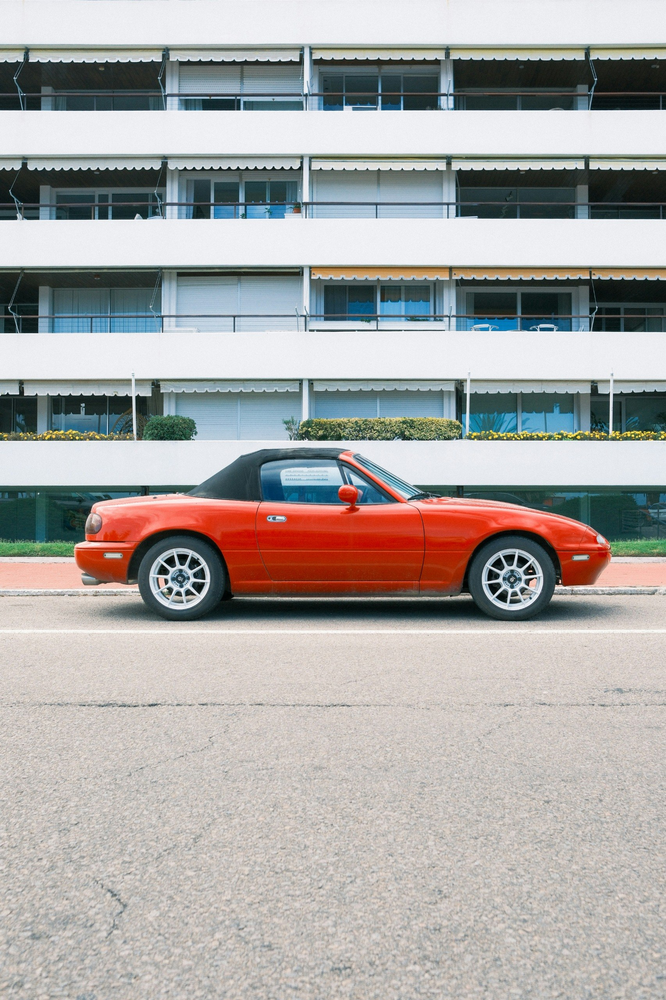 | 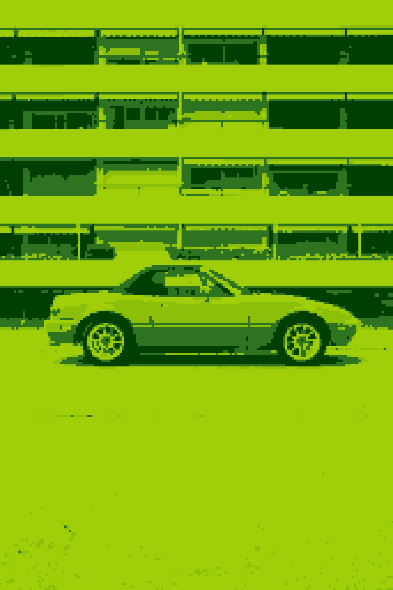 | 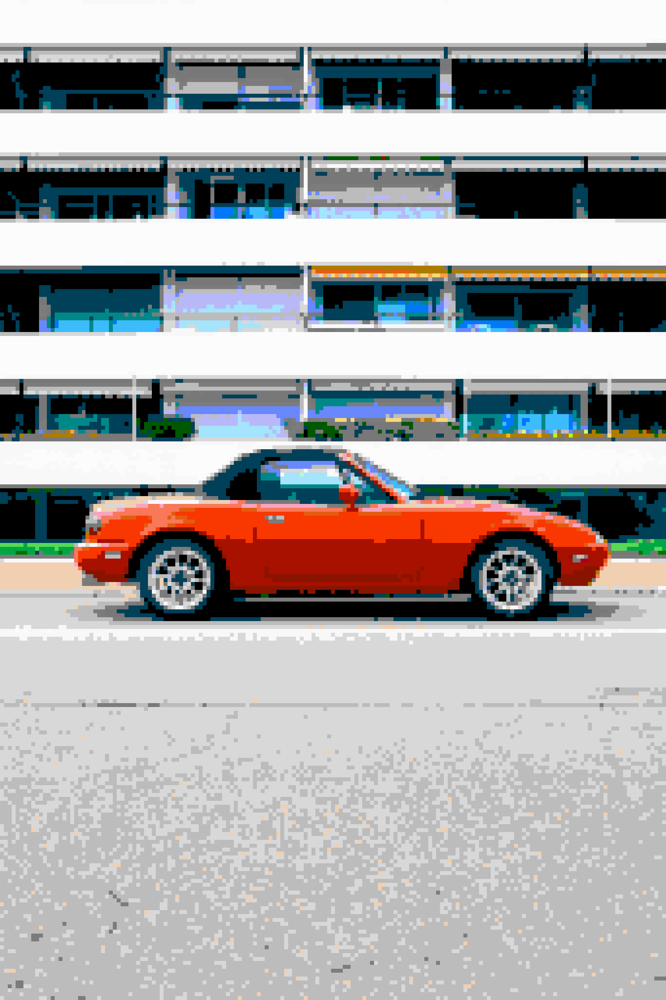 | 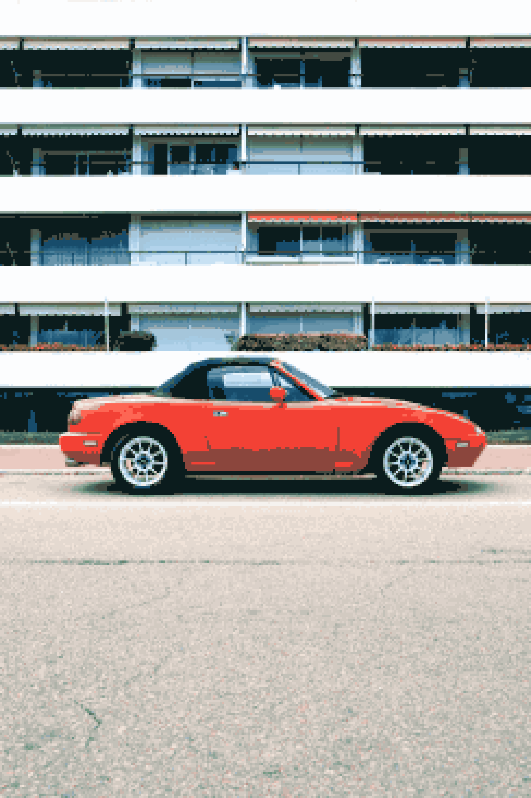 |
| *Car* | *4-color green palette* | *NES limited palette* | *64-color quantized* |

| Input | Game Boy | NES | SNES |
|----------|----------|-----|------|
|  |  |  |  |
| *Portrait* | *4-color green palette* | *NES limited palette* | *64-color quantized* |

### Video Generation (`pixelart_video.py` — text → animated MP4 + GIF)

| Cyberpunk Rain | Snow Cozy |
|----------------|-----------|
| 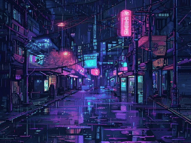 | 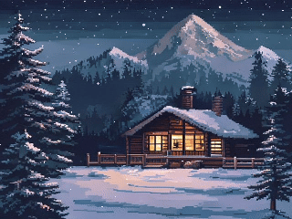 |
| *SNES + cyberpunk — neon rain street* | *NES + cozy — cabin in snow* |

## Photo Conversion Presets

`gameboy` · `nes` · `snes` · `gba` · `pico8` · `c64` · `vga` · `arcade` · `clean` · `detailed` · `minimal` · `mspaint` · `apple2` · `teletext`

## Named Palettes

**Hardware:** `NES` · `C64` · `ZX_SPECTRUM` · `PICO_8` · `GAMEBOY_ORIGINAL` · `GAMEBOY_POCKET` · `APPLE_II_HI` · `MICROSOFT_WINDOWS_16` · `MICROSOFT_WINDOWS_PAINT` · `TELETEXT` · `CGA_MODE4_PAL1` · `MSX` · `COMMODORE_64` · `MONO_BW` · `MONO_AMBER` · `MONO_GREEN`

**Artistic:** `PASTEL_DREAM` · `NEON_CYBER` · `RETRO_WARM` · `OCEAN_DEEP` · `FOREST_MOSS` · `SUNSET_FIRE` · `ARCTIC_ICE` · `VINTAGE_ROSE` · `EARTH_CLAY` · `ELECTRIC_VIOLET`

## Image Generation Styles

**Artistic:** `auto` · `cyberpunk` · `medieval` · `anime` · `noir` · `western` · `scifi` · `kawaii` · `steampunk` · `horror` · `underwater` · `postapoc` · `retro` · `cozy`

**Technical:** `nes` · `snes` · `indie` · `arcade` · `gameboy` · `clean` · `gb`

**Scene (video):** `night` · `dusk` · `tavern` · `indoor` · `urban` · `nature` · `magic` · `storm` · `underwater` · `fire` · `snow` · `desert`

## Configuration

| Variable | Default | Description |
|----------|---------|-------------|
| `PIXELART_OUTPUT` | `./pixelart_output` | Output directory |
| `PIXELART_MEMORY` | `./pixelart_memory.json` | Prompt memory file |

## How It Works

**Photo conversion:** Wu's Color Quantization finds optimal palette colors. Supports 40+ named palettes from real retro hardware.

**Image generation:** Pollinations generates pixel art natively from text prompts.

**Videos:** Pollinations base frame + pixel art animations overlaid (stars, rain, fireflies). Encoded as h264 MP4.

## API Notes

- Pollinations is free, no API key needed
- Rate limit: ~1 request per 60 seconds
- Same prompt = same output (aggressive caching)
- Max effective resolution: 768×768

## Requirements

- Python 3.9+
- Pillow
- requests
- scipy (optional, for Sobel edge-aware downsampling)
- ffmpeg (for video encoding)

## License

MIT
